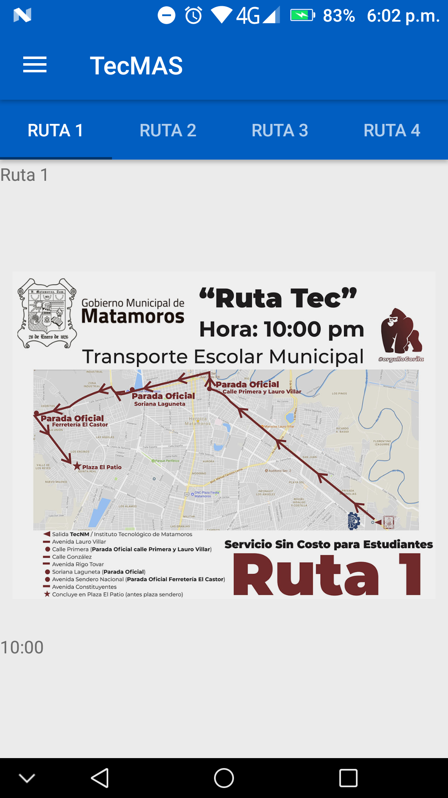
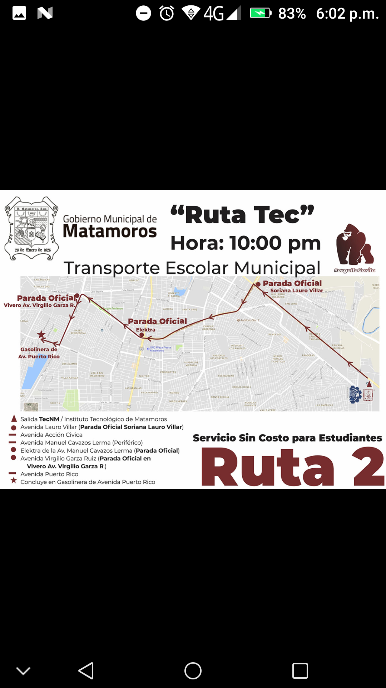

# Tec-MAS
 **Sistema informativo de comunicación y difusión para la comunidad del TecNM/ITM**

** Seguimos trabajando en el nombre*

-----

### ¿Qué es Tec-Mas?

Tec-MAS pretende ser un medio de comunicación y difusión de información entre la institución educativa TecNM/ITM y su comunidad estudiantil, permitiendo ofrecer la información importante y de relevancia académica de la forma mas oportuna y rápida posible.

-----------

### Notas de Versión:

La presente versión resuelve el problema de lag entre pestañas del apartado de transporte. Al ultimo el problema era generado por el peso de las imágenes que eran cargadas el ImageView. Al ultimo se recurrió al uso de la librería Picasso para la carga de imágenes, de esta manera logramos cargar las imágenes desde internet en resoluciones aceptables de buena calidad y con menos peso y esfuerzo de renderizado.

A su vez se ha incorporado una nueva función que esperamos funcione para el resto de los elementos de imagen. Consiste en un visor de imagen, el cual despliega la imagen pinchada en un activity independiente, el cuál permite hacer zoom.

##### Notas del desarrollador y cosas por hacer:

Aunque ya están resueltos los dilemas de la versión Android-19.10.13v2 aún tengo el deseo de ver la posibilidad de cargar los mapas con google maps para una vista mas interactiva.

**Capturas de Pantalla:**

-------

#### Mapa Interactivo:

El desarrollo del apartado mapa interactivo corresponde a un entorno de realidad aumentada que permita de una forma interactiva, visitar y observar el campus institucional. Sin embargo este proyecto no corresponde totalmente a nuestro equipo de trabajo, por lo tanto si los desarrolladores permiten en posteriores versiones presentaremos el link del repositorio en este apartado.

-------

**Aclaraciones:** *el presente repositorio al día de hoy no tiene ni guarda ninguna relación directa con el TecNM, simplemente es una propuesta de desarrollo hecha con motivo académico para las materias de Taller de Investigación 1 y Taller de Investigación 2 vistas en la carga curricular de la carrera de Ing. En Sistemas Computacionales.*