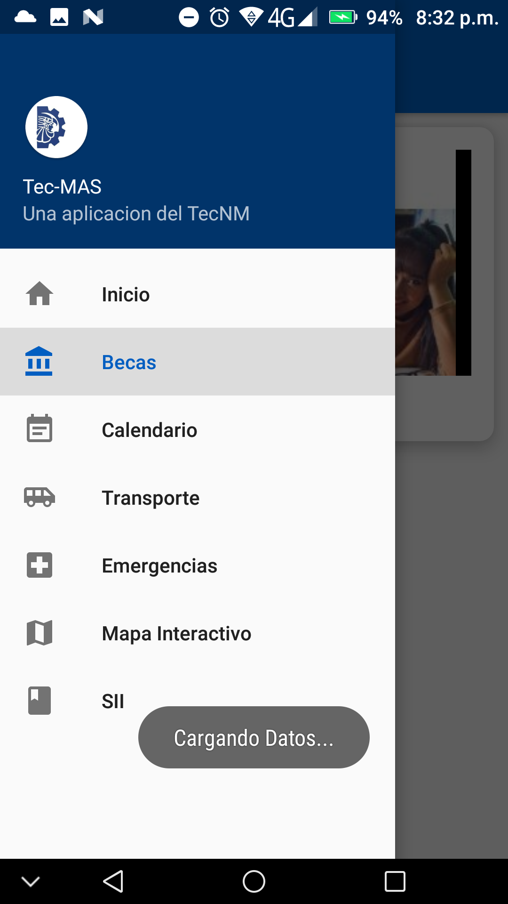
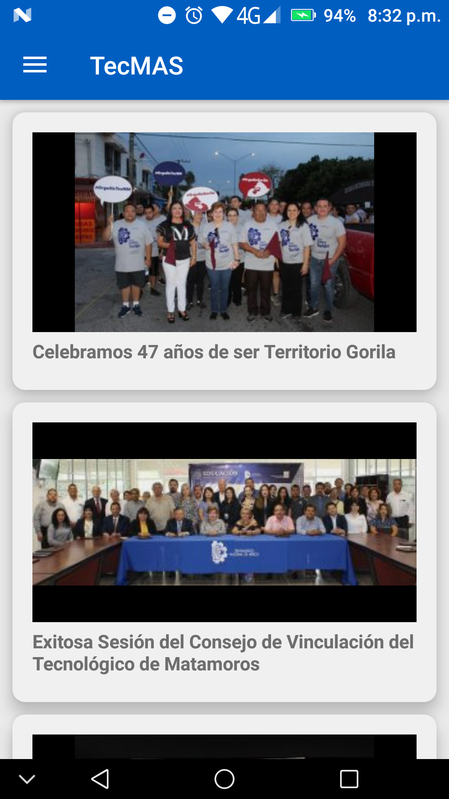
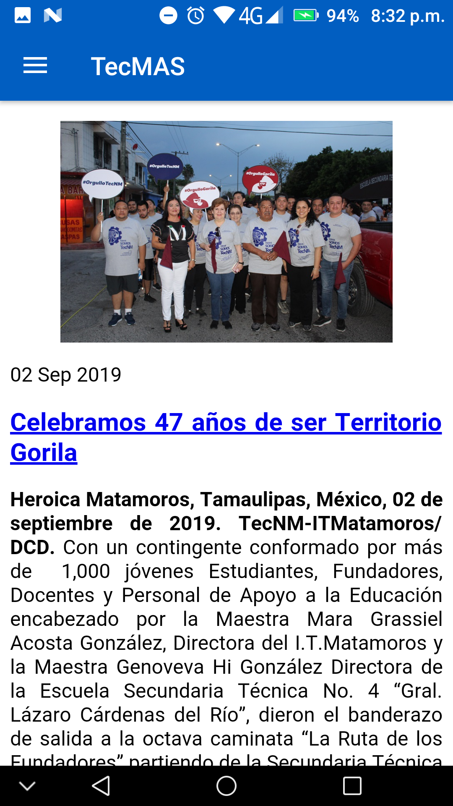
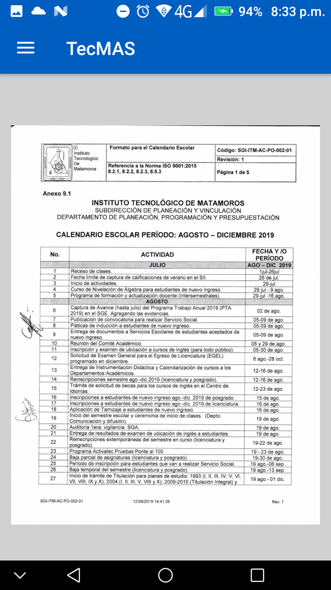
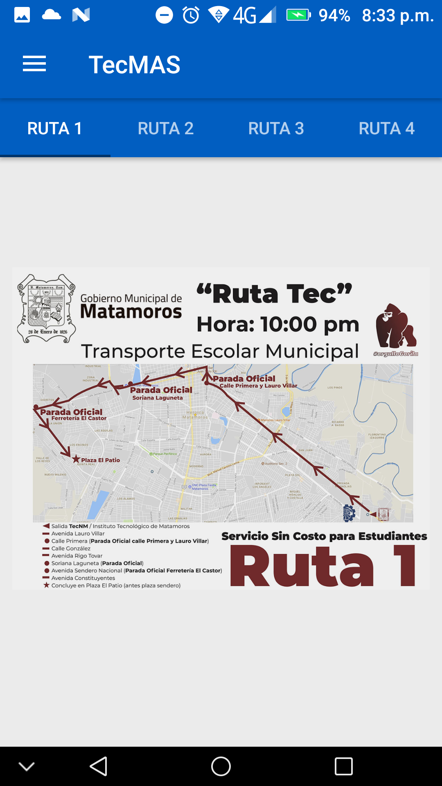
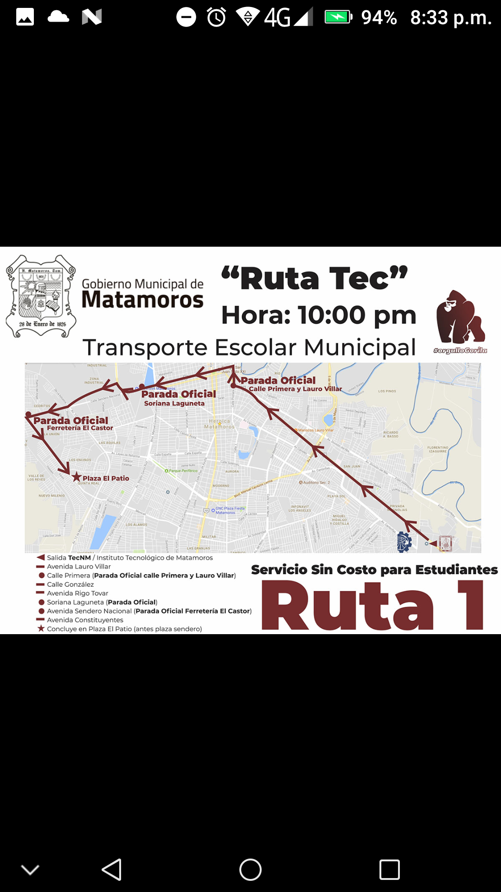
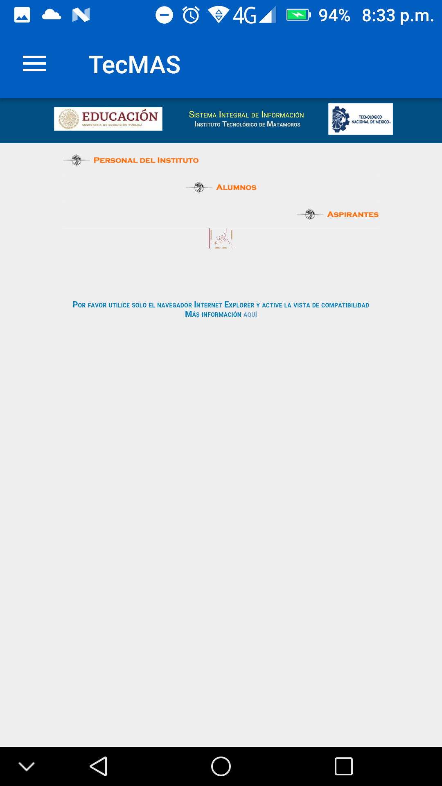

# Tec-MAS
 **Sistema informativo de comunicación y difusión para la comunidad del TecNM/ITM**

** Seguimos trabajando en el nombre*

-----

### ¿Qué es Tec-Mas?

Tec-MAS pretende ser un medio de comunicación y difusión de información entre la institución educativa TecNM/ITM y su comunidad estudiantil, permitiendo ofrecer la información importante y de relevancia académica de la forma mas oportuna y rápida posible.

-----------

### Notas de Versión:

La presente versión trae ciertas mejoras desde el lado del backend es así que se ha implementado:

- La instalación de plugins del lado del servidor de pruebas (El CMS usado es wordpress):
  -  	Se instalo Wordpress Rest API v2
  -  	Better REST API Featured Images
- Con lo anterior nuestra aplicación ya puede servirse información de entradas directamente desde el servidor por medio de cadenas tipo JSON.
- Se ha implementado un visor de pdfs para visualizar el calendario escolar en formato digital (Me gustaría hacer algo mas vistoso pero por ahora esta bien xd ).

##### Notas del desarrollador y cosas por hacer:

* El diseño: no me agrada espero mejorarlo.
* Los webviews de las secciones de inicio, emergencias y becas tienen un ligero bug parcheado de forma rápida, el problema consiste en que al navegar atreves de hipervínculos y tratar de regresar a la pagina anterior por retroceso, esta carga en blanco. Por ahora se ha impedido esta función, todo link abierto es redireccionado por ahora al navegador por defecto del teléfono.
* Implementar una base de datos en SQLite donde almacenar los datos recurrentes. La aplicación carga lentamente los elementos en los apartados de inicio, becas y emergencias debido a la necesidad de pedir los elementos por internet. Es por ello que se pretende agilizar la carga al solicitar los datos recurrentes localmente y en caso de necesitar información extra será necesario la petición al servidor.

**Capturas de Pantalla:**

-------

#### Mapa Interactivo:

El desarrollo del apartado mapa interactivo corresponde a un entorno de realidad aumentada que permita de una forma interactiva, visitar y observar el campus institucional. Sin embargo este proyecto no corresponde totalmente a nuestro equipo de trabajo, por lo tanto si los desarrolladores permiten en posteriores versiones presentaremos el link del repositorio en este apartado.

-------

**Aclaraciones:** *el presente repositorio al día de hoy no tiene ni guarda ninguna relación directa con el TecNM, simplemente es una propuesta de desarrollo hecha con motivo académico para las materias de Taller de Investigación 1 y Taller de Investigación 2 vistas en la carga curricular de la carrera de Ing. En Sistemas Computacionales.*

**Descargas:** 

La apk de la aplicación al momento esta disponible <a href="https://github.com/AmbrocioIsaias2808/Tec-MAS/blob/Android-19.10.23.03-(Inicio-Apartado-Informaci%C3%B3n)/READMEFILES/Tec-MAS2.apk?raw=true">aquí</a>

