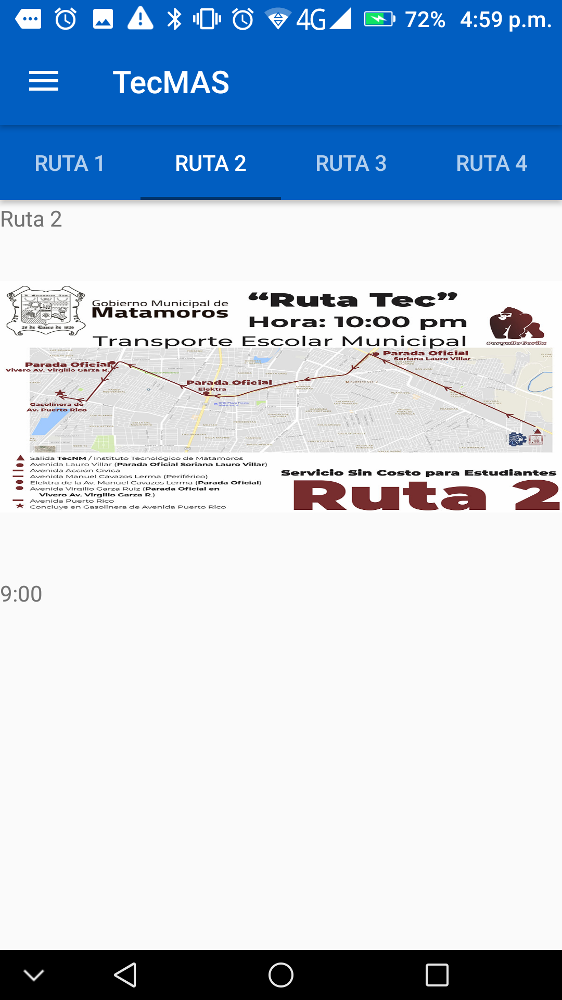

# Tec-MAS
 **Sistema informativo de comunicación y difusión para la comunidad del TecNM/ITM**

** Seguimos trabajando en el nombre*

-----

### ¿Qué es Tec-Mas?

Tec-MAS pretende ser un medio de comunicación y difusión de información entre la institución educativa TecNM/ITM y su comunidad estudiantil, permitiendo ofrecer la información importante y de relevancia académica de la forma mas oportuna y rápida posible.

Tec-MAS esta pensado para ser una aplicación móvil que conecte con varios servicios y brinde en su interior todo tipo de contenido relacionado a eventos, noticias e información de interés académico y necesite ser comunicado a la brevedad.

-----------

### Notas de Versión:

La presente versión incorpora el boceto de lo que será el apartado de transporte, donde se presentarán los mapas y horarios correspondientes a las rutas de transporte nocturno.

##### Notas del desarrollador y cosas por hacer:

* La presente interfaz tiene un cierto retrase o lagueo en el desplazamiento entre pestañas, probablemente debido o a la carga de los mapas y/o de la forma de creación de los objetos que le dan origen. En resumen es un aspecto a resolver.

* Necesitamos pensar en la forma de interactuar con el mapa, ya sea:

	* Colocando un mapa de google maps y mandarlo llamar desde una instancia externa.
	* Dejar el formato de imagen pero agregar la interctividad de poder dar click, zoom y demas.

**Capturas de Pantalla:**

-------

#### Mapa Interactivo:

El desarrollo del apartado mapa interactivo corresponde a un entorno de realidad aumentada que permita de una forma interactiva, visitar y observar el campus institucional. Sin embargo este proyecto no corresponde totalmente a nuestro equipo de trabajo, por lo tanto si los desarrolladores permiten en posteriores versiones presentaremos el link del repositorio en este apartado.

-------

**Aclaraciones:** *el presente repositorio al día de hoy no tiene ni guarda ninguna relación directa con el TecNM, simplemente es una propuesta de desarrollo hecha con motivo académico para las materias de Taller de Investigación 1 y Taller de Investigación 2 vistas en la carga curricular de la carrera de Ing. En Sistemas Computacionales.*
