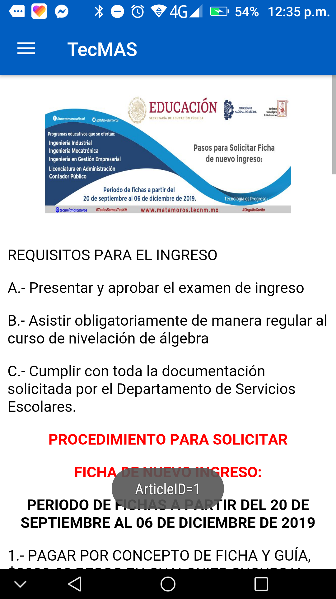
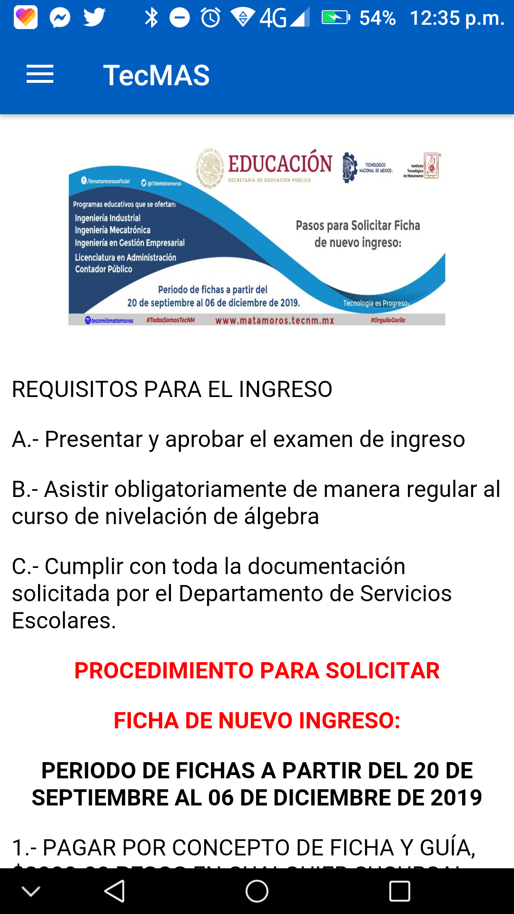

# Tec-MAS
 **Sistema informativo de comunicación y difusión para la comunidad del TecNM/ITM**

** Seguimos trabajando en el nombre*

-----

### ¿Qué es Tec-Mas?

Tec-MAS pretende ser un medio de comunicación y difusión de información entre la institución educativa TecNM/ITM y su comunidad estudiantil, permitiendo ofrecer la información importante y de relevancia académica de la forma mas oportuna y rápida posible.

-----------

### Notas de Versión:

La presente versión incorpora una nueva característica en el apartado de inicio. Consiste en la habilidad de poder dar click sobre las tarjetas de eventos para desplegar una pantalla dedicada a la lectura del contenido informativo (**sección del articulo**)

A su vez el fragment de **sección del articulo** o de información del mismo despliega el contenido en un webview basandose de tecnologías web para el despliegue formateado del texto y contenido.

##### Notas del desarrollador y cosas por hacer:

* Aunque ya están resueltos los dilemas de la versión Android-19.10.13v2 aún tengo el deseo de ver la posibilidad de cargar los mapas con google maps para una vista mas interactiva.
* La versión Android 19.10.22-(Inicio-Apartado-Informacion) aún presenta algunos bus en el fragmento de **sección del articulo**  (los archivos relacionados son *fragment_información*). El detalle consiste en que no es posible abrir por el momento urls agregadas en el contenido o ir a links externos, se presume de falta de permisos y/o alguna funcionalidad faltante. Este **apartado requiere revisión**.

**Capturas de Pantalla:**

-------

#### Mapa Interactivo:

El desarrollo del apartado mapa interactivo corresponde a un entorno de realidad aumentada que permita de una forma interactiva, visitar y observar el campus institucional. Sin embargo este proyecto no corresponde totalmente a nuestro equipo de trabajo, por lo tanto si los desarrolladores permiten en posteriores versiones presentaremos el link del repositorio en este apartado.

-------

**Aclaraciones:** *el presente repositorio al día de hoy no tiene ni guarda ninguna relación directa con el TecNM, simplemente es una propuesta de desarrollo hecha con motivo académico para las materias de Taller de Investigación 1 y Taller de Investigación 2 vistas en la carga curricular de la carrera de Ing. En Sistemas Computacionales.*