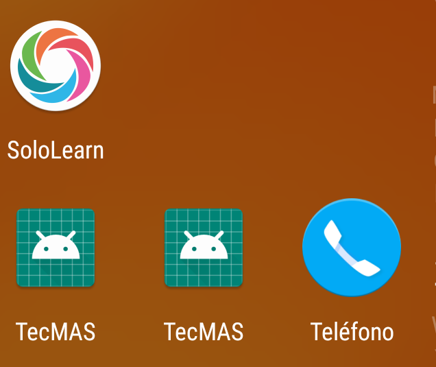
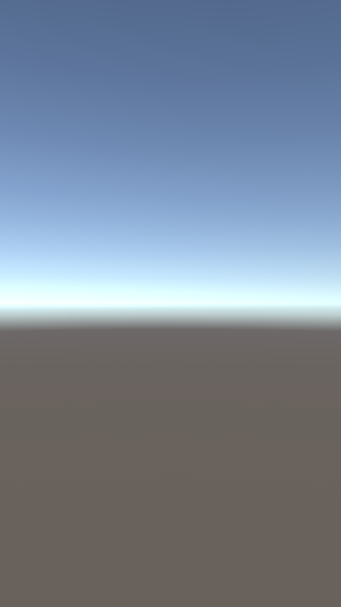

# Tec-MAS
 **Sistema informativo de comunicación y difusión para la comunidad del TecNM/ITM**

** Seguimos trabajando en el nombre*

-----

### ¿Qué es Tec-Mas?

Tec-MAS pretende ser un medio de comunicación y difusión de información entre la institución educativa TecNM/ITM y su comunidad estudiantil, permitiendo ofrecer la información importante y de relevancia académica de la forma mas oportuna y rápida posible.

Tec-MAS esta pensado para ser una aplicación móvil que conecte con varios servicios y brinde en su interior todo tipo de contenido relacionado a eventos, noticias e información de interés académico y necesite ser comunicado a la brevedad.

-----------

### Notas de Versión:

En la presente versión se ha tratado de embeber el desarrollo de el aplicativo correspondiente al **Mapa Interactivo** el resultado fue el siguiente:

* El proceso de integración ha fallado, para empezar es un proceso tedioso al momento de modificar los archivos correspondientes y saltar los errores que general.
* En un principio parecía que el proceso había sido un éxito sin embargo:
	* Por alguna razón se instalan dos aplicativos bajo el mismo nombre, uno correspondiente a la aplicación normal y otra que contiene el proyecto en unity.
	* Al abrir la aplicación principal el aplicativo funciona sin problemas, pero al llamar al proyecto en Unity:
		* En un principio crasheaba y se cerraba, recompilamos el proyecto y reiniciamos android studio, una vez hecho esto intentamos nuevamente, el resultado fue que ahora no se cerraba la aplicación y abría el proyecto en unity, sin embargo:
		* Lo único que muestra es un fondo con degradado y hasta allí.

**Nota personal: ** desconozco si es error vuestro o problemas con el código, el proceso de pruebas inicio a las 10:00am y termino a las 5:00pm del día que marca la rama de versión, por hoy dejaré el proyecto, checaremos después.

**Capturas: **

Fuentes consultadas por el momento:

**Para el proceso de integración:**

* https://medium.com/@davidbeloosesky/embedded-unity-within-android-app-7061f4f473a
* https://medium.com/@angelhiadefiesta/integrate-a-unity-module-to-a-native-android-app-87644fe899e0

**Para la depuración de errores:**

* https://stackoverflow.com/questions/50267339/export-android-library-as-aar-file
* https://stackoverflow.com/questions/54234394/how-to-resolve-could-not-find-method-bundle-for-arguments-build-6plat21h/54427212
* https://stackoverflow.com/questions/52645127/could-not-find-method-bundle
* https://stackoverflow.com/questions/56925251/manifest-merger-failed-uses-sdkminsdkversion-15-cannot-be-smaller-than-versio

-------

#### Mapa Interactivo:

El desarrollo del apartado mapa interactivo corresponde a un entorno de realidad aumentada que permita de una forma interactiva, visitar y observar el campus institucional. Sin embargo este proyecto no corresponde totalmente a nuestro equipo de trabajo, por lo tanto si los desarrolladores permiten en posteriores versiones presentaremos el link del repositorio en este apartado.

-------

**Aclaraciones:** *el presente repositorio al día de hoy no tiene ni guarda ninguna relación directa con el TecNM, simplemente es una propuesta de desarrollo hecha con motivo académico para las materias de Taller de Investigación 1 y Taller de Investigación 2 vistas en la carga curricular de la carrera de Ing. En Sistemas Computacionales.*